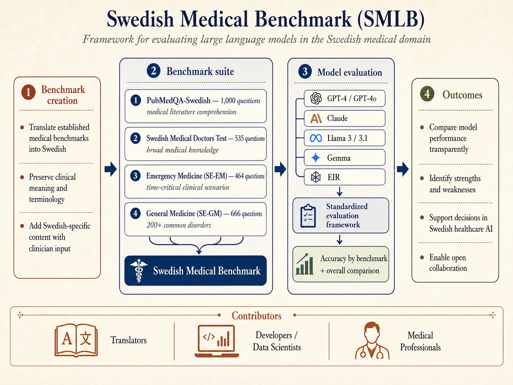
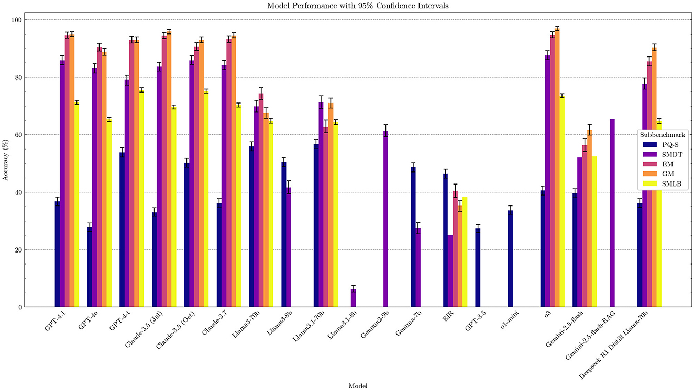
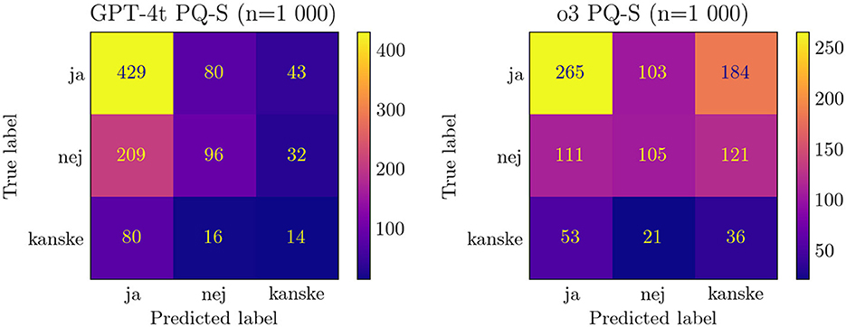
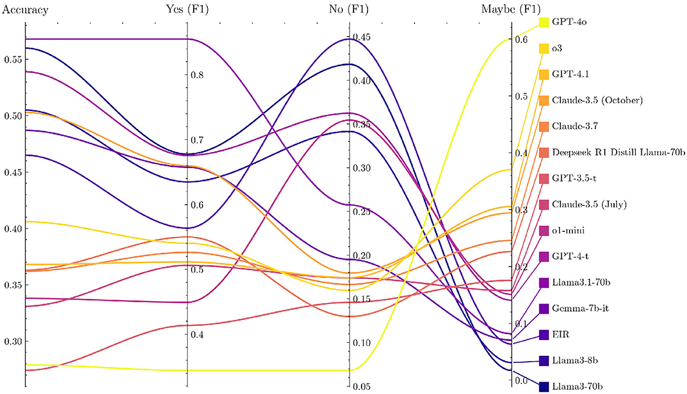
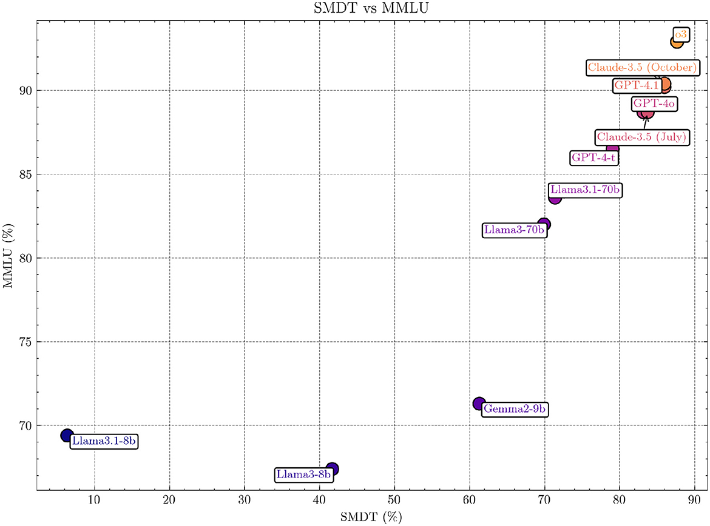

# Swedish Medical Benchmark (SMLB)



**A framework for evaluating large language models in the Swedish medical domain.**

Created by **Birger Moëll**, **Fabian Farestam**, and **Jonas Beskow**.

SMLB brings together Swedish medical exams, clinical case questions, emergency
medicine scenarios, general medicine cases, and translated biomedical literature
questions into one open benchmark suite. The goal is simple: make it easier to
measure how well language models handle Swedish medical reasoning, terminology,
and clinically relevant multiple-choice tasks.

[Paper](https://www.frontiersin.org/journals/artificial-intelligence/articles/10.3389/frai.2025.1557920/full) ·
[PDF](https://www.frontiersin.org/journals/artificial-intelligence/articles/10.3389/frai.2025.1557920/pdf) ·
[Benchmark descriptions](benchmarks/BENCHMARK_DESCRIPTIONS.md) ·
[GRPO dataset](grpo/README.md)

## What The Paper Figures Show

The figures tell a more interesting story than a leaderboard alone. Strong
general-purpose models usually do well, but performance differs sharply across
sub-benchmarks. PubMedQA-Swedish is especially revealing: several models show
answer-label bias rather than balanced evidence comprehension, while the
Swedish doctors test aligns strongly with broader general-knowledge benchmarks.

| Model performance | PubMedQA-Swedish confusion matrices |
|---|---|
|  |  |

**Figure 1** shows that the best-performing frontier models cluster near the top
on emergency medicine, general medicine, and SMDT, while smaller/open models vary
substantially. It also shows why a single aggregate score can hide important
differences between literature comprehension, clinical exam knowledge, and
case-based reasoning.

**Figure 2** shows that PubMedQA-Swedish is not only about accuracy. The
confusion matrices reveal different answer tendencies for `ja`, `nej`, and
`kanske`; a model can look better or worse depending on whether it overuses a
frequent label.

| PubMedQA-Swedish F1 metrics | SMDT vs MMLU |
|---|---|
|  |  |

**Figure 3** breaks PubMedQA-Swedish into label-level F1 scores. This makes the
label imbalance visible: a model that performs well on `ja` may still struggle
with `nej` or `kanske`, which is important for medical literature tasks where
uncertainty matters.

**Figure 4** compares SMDT with MMLU and shows a strong positive relationship.
That suggests Swedish medical exam performance is partly linked to broad model
capability, but SMLB still adds value by testing Swedish clinical language and
domain-specific answer formats directly.

Figures are reproduced from Moëll, Farestam and Beskow (2025), published in
Frontiers in Artificial Intelligence under the Creative Commons Attribution
License (CC BY).

## What Is Included

| Benchmark | Short name | Questions | Task shape | Notes |
|---|---:|---:|---|---|
| PubMedQA-Swedish | PQ-S | 1,000 | yes/no/maybe | Swedish translation of PubMedQA for medical literature comprehension |
| Swedish Medical Doctors Test | SMDT | 535 | multiple choice | Swedish clinical exam-style questions across broad medical knowledge |
| Emergency Medicine | SE-EM | 464 | multiple choice | Time-critical emergency medicine scenarios |
| General Medicine | SE-GM | 666 | multiple choice | Primary-care-oriented cases covering 200+ common disorders |
| Specialist questions | SMB | varies | multiple choice | Specialty-specific Swedish medical questions |
| GRPO/RLVR dataset | SMLB-GRPO | 2,261 | reward-verifiable MCQ | Native Swedish subset for RL experiments with deterministic rewards |

## Why This Exists

Most medical LLM benchmarks are English-first. Swedish healthcare has its own
clinical language, exam traditions, documentation style, abbreviations, and
practice context. SMLB helps researchers and builders evaluate whether a model
can work with those Swedish-specific conditions instead of only general English
medical knowledge.

This benchmark is intended for research, evaluation, and medical education
experiments. It is not a clinical decision system.

## Quickstart

Use Python 3.10 or newer.

```bash
python -m venv .venv
source .venv/bin/activate
python -m pip install -r requirements.txt
python run_llm/huggingface.py --output results/example-pubmedqa.json
python evaluate_performance.py --results results/example-pubmedqa.json
```

Run commands from the repository root. The default Hugging Face run evaluates
`birgermoell/eir` on PubMedQA-Swedish and writes a SMLB-compatible results JSON.

## Evaluate a Model

Use this workflow when you want to evaluate a new model, compare two models, or
measure a change such as fine-tuning, RAG, quantization, prompting, or decoding
settings. The most important rule is to keep the benchmark list, prompt
templates, and decoding settings fixed across the runs you want to compare.

Choose the benchmark list before looking at the results. If you can, run every
benchmark supported by your runner. If you only run a subset because of cost,
context length, licensing, hardware, or a specific research question, report the
subset clearly and avoid presenting it as a full SMLB score.

```bash
python run_llm/huggingface.py \
  --model-name /path/to/model-or-hf-id \
  --benchmarks EmergencyMedicine GeneralPractioner SwedishDoctorsExam PubMedQA-L-SWE \
  --output results/my-model-smlb.json
```

For a before/after comparison, run the same command twice and only change the
model path or ID:

```bash
python run_llm/huggingface.py \
  --model-name /path/to/baseline-model \
  --benchmarks EmergencyMedicine GeneralPractioner SwedishDoctorsExam PubMedQA-L-SWE \
  --output results/my-model-baseline-smlb.json

python run_llm/huggingface.py \
  --model-name /path/to/changed-model \
  --benchmarks EmergencyMedicine GeneralPractioner SwedishDoctorsExam PubMedQA-L-SWE \
  --output results/my-model-changed-smlb.json
```

Then evaluate each result file. Saving the text report is helpful when opening a
PR, comparing runs, or writing a paper:

```bash
python evaluate_performance.py \
  --results results/my-model-smlb.json \
  --save-result-path results/my-model-smlb-eval.txt
```

Each results JSON stores `llm_info`, benchmark names, prompts, item IDs, ground
truths, and predictions. Keep the JSON file with the text report so the run can
be audited later.

### Reporting New Results

When reporting or submitting a new model result, include enough information for
someone else to reproduce the evaluation:

- exact model name, provider, checkpoint, revision, or local checkpoint
  description,
- whether the model is base, instruction-tuned, fine-tuned, RAG-assisted,
  quantized, merged, distilled, or otherwise modified,
- benchmark list, number of evaluated questions per benchmark, and any skipped
  benchmarks,
- prompt templates and answer-format instructions,
- decoding settings such as sampling, temperature, top-p, max tokens, and seed
  when applicable,
- hardware/runtime details if they affect the result, such as quantization,
  precision, or inference framework,
- SMLB commit hash and the exact runner and evaluation commands,
- result JSON file and evaluation text output,
- malformed-answer counts as well as accuracy/F1,
- a contamination statement: whether SMLB questions, answers, explanations, or
  prompts were used for training, synthetic data generation, prompt tuning,
  reward modeling, retrieval, model selection, or manual debugging.

If you want a model added to the public results table, open an issue or pull
request with the result JSON, the text evaluation report, and the metadata above.
Partial results are welcome when they are clearly marked. Results with known
SMLB contamination can still be useful for analysis, but they should not be
described as external benchmark results.

Accuracy is useful for the multiple-choice tasks, but avoid relying on a single
aggregate score. PubMedQA-Swedish is label-imbalanced, so inspect precision,
recall, F1, and the confusion matrix for `ja`, `nej`, and `kanske`. For model
comparison studies, report the per-benchmark delta and watch for regressions on
benchmarks outside the target domain or tuning objective.

## GRPO / RLVR Experiments

The repo includes a compact GRPO/RLVR dataset for experiments with verifiable
medical multiple-choice rewards. The default build uses native Swedish sources
and excludes translated MedQA.

```bash
python grpo/build_grpo_dataset.py --output-dir data/grpo
python grpo/smoke_local_mac.py --dataset-dir data/grpo
```

CUDA training with TRL:

```bash
pip install -r requirements-grpo.txt
python grpo/train_grpo_cuda.py \
  --model-name google/gemma-2-2b-it \
  --dataset-dir data/grpo \
  --output-dir outputs/gemma2-2b-smlb-grpo \
  --bf16
```

The GRPO dataset currently contains:

| Split | Rows |
|---|---:|
| train | 1,822 |
| validation | 227 |
| test | 212 |

See [grpo/README.md](grpo/README.md) for details on reward functions, local Mac
smoke checks, optional translated PubMedQA inclusion, and CUDA settings.

## Preliminary Results

Accuracy is reported as a percentage. A dash means that the model has not been
evaluated on that benchmark in the current results table.

| Model | PQ-S | SMDT | EM | GM | SMB |
|---|---:|---:|---:|---:|---:|
| GPT-4o | - | **83.18** | 90.51 | 88.88 | - |
| GPT-4 | 53.90 | 79.07 | **93.10** | **93.09** | **75.57** |
| Claude-3.5 | - | **83.74** | - | - | - |
| Llama3-70b | 56.00 | 69.91 | 74.35 | 67.57 | 64.88 |
| Llama3-8b | 50.50 | 41.68 | - | - | - |
| Llama3.1-70b | - | 71.40 | 62.93 | 71.02 | - |
| Llama3.1-8b | - | 6.36 | - | - | - |
| Gemma2-9b | - | 61.31 | - | - | - |
| Gemma-7b | 48.70 | 27.48 | - | - | - |
| EIR | 46.50 | - | - | - | - |
| GPT-3.5 | 27.40 | - | - | - | - |

## Repository Map

| Path | Purpose |
|---|---|
| [benchmarks/](benchmarks/) | Source benchmark datasets and benchmark descriptions |
| [run_llm/](run_llm/) | Model runner setup for API and Hugging Face models |
| [results/](results/) | Stored model result files |
| [grpo/](grpo/) | GRPO dataset builder, local smoke tests, and CUDA training script |
| [data/grpo/](data/grpo/) | Generated GRPO JSONL train/validation/test splits |
| [docs/](docs/) | GitHub Pages-style project page |
| [website/](website/) | Static website copy |

## For AI Agents

This section is intentionally explicit so coding agents can work on the repo
without rediscovering the basics.

- Project goal: evaluate LLMs on Swedish medical benchmark tasks.
- Default working directory: repository root.
- Use Python 3.10+.
- Main evaluation entry point: `python evaluate_performance.py --results results/example-pubmedqa.json`.
- Hugging Face runner example: `python run_llm/huggingface.py --model-name /path/to/model --benchmarks PubMedQA-L-SWE --output results/example-pubmedqa.json`.
- Supported Hugging Face benchmark names: `PubMedQA-L-SWE`, `GeneralPractioner`, `EmergencyMedicine`, `SwedishDoctorsExam`.
- Benchmark implementations live in `run_llm/benchmark_set_up.py`.
- Human-readable benchmark descriptions live in `benchmarks/BENCHMARK_DESCRIPTIONS.md`.
- GRPO dataset builder: `python grpo/build_grpo_dataset.py --output-dir data/grpo`.
- Local GRPO sanity check: `python grpo/smoke_local_mac.py --dataset-dir data/grpo`.
- CUDA GRPO script: `python grpo/train_grpo_cuda.py --model-name google/gemma-2-2b-it --dataset-dir data/grpo --bf16`.
- Do not treat SMLB or SMLB-GRPO as clinical deployment data. Use it for evaluation, research, and medical education experiments.
- Translated MedQA is not part of the default GRPO build. PubMedQA-Swedish can be included with `--include-translated-pubmedqa`.
- Preserve provenance fields when adding data. New benchmark rows should keep source file, task type, answer format, and licensing notes clear.

## Contributing

Useful contributions include:

- improving Swedish medical translations and terminology,
- adding clinically reviewed Swedish questions,
- expanding model evaluations,
- improving benchmark loaders and metrics,
- strengthening GRPO/RLVR data quality,
- documenting dataset provenance and limitations.

Medical professionals, translators, data scientists, and developers are all
welcome. Join the community on Discord:
<https://discord.gg/AgDx34t2>

## How Can I Contribute?

SMLB is most valuable when it improves in ways that are clinically meaningful,
transparent, and easy to reproduce. High-impact contributions include:

- **Clinicians:** review questions and answers, flag ambiguous cases, add notes
  about Swedish clinical practice, and help identify unsafe benchmark
  assumptions.
- **Researchers:** run new model evaluations, compare prompting strategies,
  analyze error patterns, and add statistically sound confidence intervals.
- **Developers:** improve benchmark loaders, result parsing, reproducibility,
  documentation, and CI checks.
- **Data contributors:** add Swedish medical questions with clear provenance,
  licensing, answer keys, and task format.
- **RL/LLM contributors:** improve the GRPO/RLVR dataset, add reward checks,
  test small-model training recipes, and document failure cases.

When adding data, preserve provenance and licensing information. When adding
results, include the exact model name, model version/date when available,
prompting setup, decoding parameters, and evaluation script used.

## Citation

```bibtex
@article{moell2025swedish,
  title        = {Swedish Medical LLM Benchmark (SMLB): Development and Evaluation of a Framework for Assessing Large Language Models in the Swedish Medical Domain},
  author       = {Mo{\"e}ll, Birger and Farestam, Fabian and Beskow, Jonas},
  journal      = {Frontiers in Artificial Intelligence},
  volume       = {8},
  pages        = {1557920},
  year         = {2025},
  publisher    = {Frontiers}
}
```
